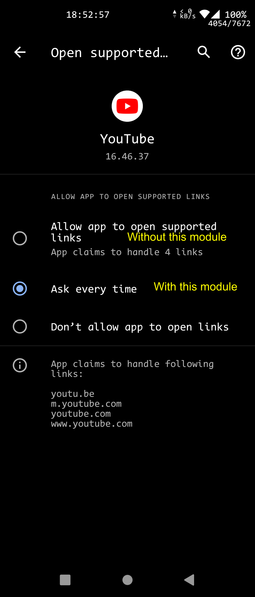

# KillDomainVerification

Related: <https://developer.android.com/training/app-links/verify-site-associations>

This xposed module prevents the system (and also yourself) from allowing apps to always open supported links.

It should support Android 6 - 11, but maybe not Android 12 and above.

模块功能：打开 http / https 链接时总是询问，而不是直接在 app 中打开

副作用：手动设也没法直接用应用打开链接

支持 Android 6 到 11

