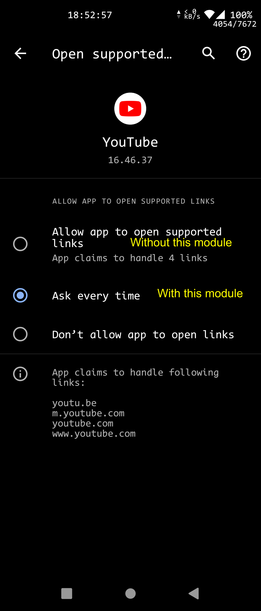
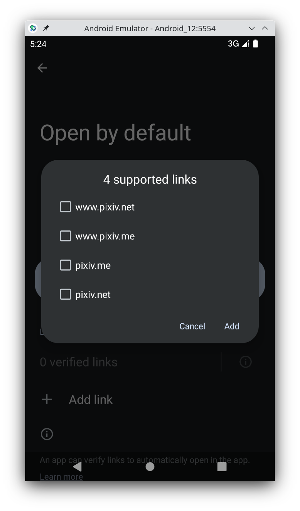
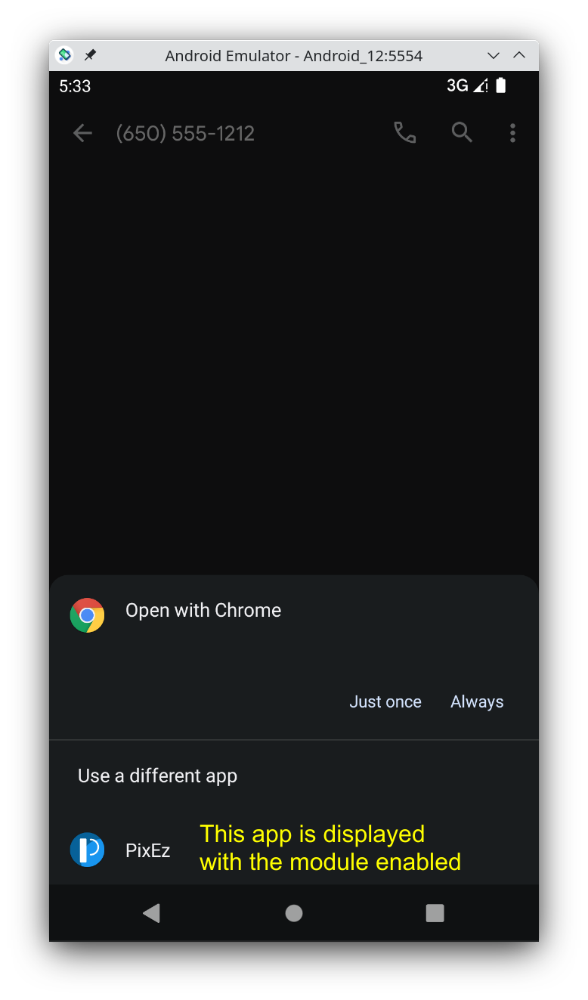

# KillDomainVerification

Related: <https://developer.android.com/training/app-links/verify-site-associations> <https://developer.android.com/about/versions/12/web-intent-resolution>

This xposed module prevents the system (and also yourself) from allowing apps to always open supported links.

It also enables you to open supported links in apps which are not "verified" on Android 12 and above.

模块功能：打开 http / https 链接时总是询问，而不是直接在 app 中打开

副作用：手动设也没法直接用应用打开链接；Android 12+ 选择时会同时显示未“验证”的 app

理论支持 Android 6 及以后

## Screenshots

### Android 11 and below

### Android 12 and above

 
